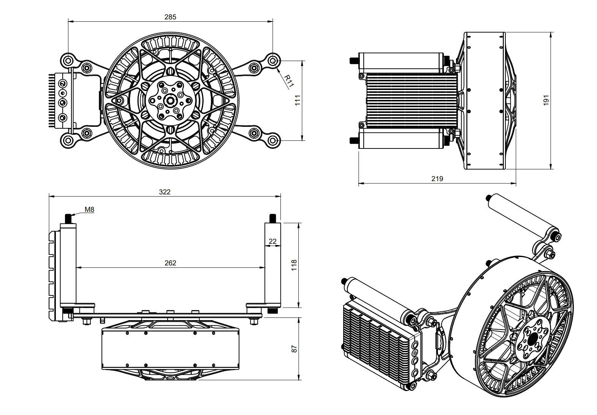
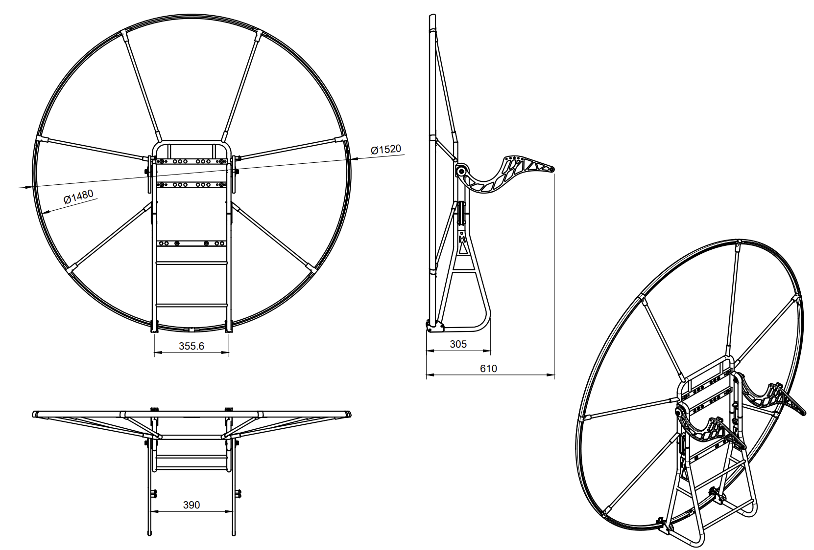

Complete 3D files can be downloaded at the link:
[https://github.com/openppg/sp140-hardware/tree/main](https://github.com/openppg/sp140-hardware/tree/main)

## Size when assembled as ready to fly
**610x1520x1520mm**

## Shipping / Transport size:
**580x400x420mm**
