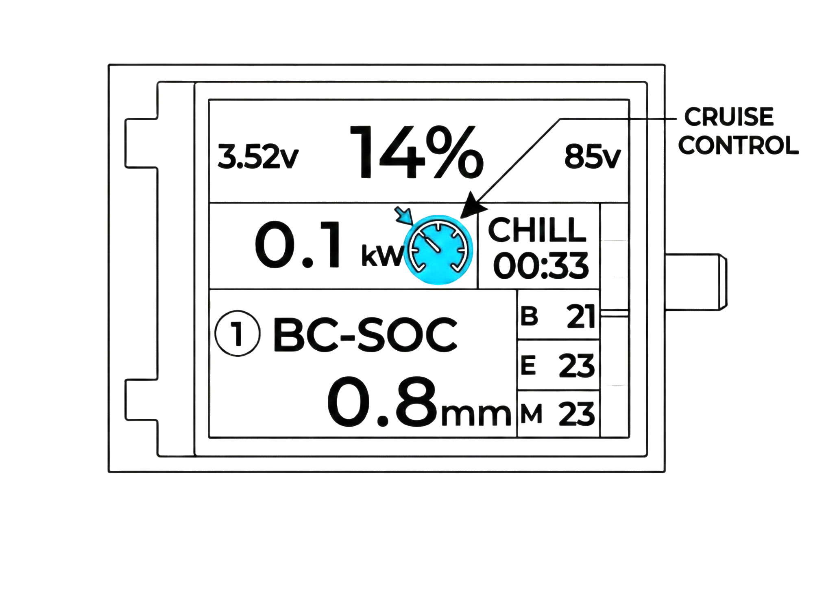
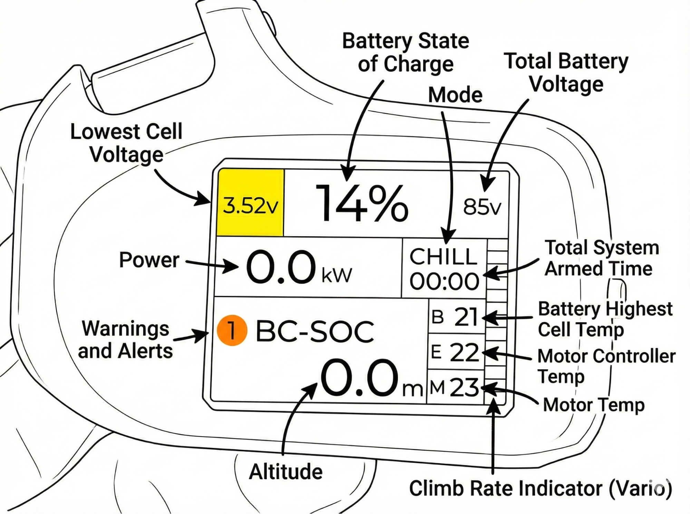

## 5.1 Motor runup (No Prop)

1. Start by having your battery plugged in followed by the main power switch turned on.
2. With your prop off the motor arming the motor can be done. Without arming the motor, the motor will not be able to spin. This is for safety so not to accidentally spin up the motor.
3. With all systems on and the main power switch in the on position, you can now arm the systems with the hand controller.
4. Arming is done with the little red button at the top of the hand controller.
5. To arm press and release the button once then press again and hold until the hand controller beeps and vibrates. (This should just take 1-2 seconds to arm or disarm and can be done at any state in flight)
6. With the system armed you can now press the throttle lever and the motor will spin up. The more the lever is depressed the faster the motor will spin.
7. You can then disarm with the same method of button presses (press and release then press and hold).

## 5.2 Cruise control test (No Prop)

1. This would also be a good time to test the cruise control function to get familiar with how it functions while the prop is off.
2. To enable cruise control you must be armed and have some power applied.
3. When at the designated power hold down the hand controller button for a second until you feel the vibration feedback from the hand controller and then you can let go of the throttle.
4. You will see on the screen the cruise control icon showing when enabled.
5. To leave cruise control, simply apply power to within 10% of the set power level and you will now have control over the throttle again manually.

## 5.3 Telemetry Link data (No Prop)

1. We can study the hand controller telemetry data displayed on the screen so you can get familiar with it.
2. The power is shown in the middle left side of the screen and you can see how it changes under different throttle levels it is shown in KW (kilowatts)
3. In the top is the SOC (state of charge) of the battery as a percentage. In the far left you will see a small number ranging from 2.5-4.2V. This is the lowest cell voltage in the battery pack. The top right corner shows the total system voltage. These voltages are mostly for advanced users who like to see this detailed info. For most users this is not relevant and they only need to notice the warning and alerts that appear automatically.
4. In the bottom right of the screen there are 3 temp boxes labeled M, B, E. This is the motor, battery, ESC (motor controller) temperatures. Again this is all handled automatically and will alert the pilot if they need to take and action but is for users who want to see some details.
5. In the middle left there is a timer that is started when the user arms the system and apply some throttle to start the stopwatch. Above the timer is the throttle mode (sport or chill).
6. In the bottom left is the altimeter, it can be set in FT or M above the ground and is reset to zero when the system is armed (your takeoff point).
7. On the far right of the screen there is a vario which shows climb/sink rate represented in colored bars.
8. Should any warnings or errors arise, they will be shown in the bottom left of the screen along with the number of errors or warnings.

