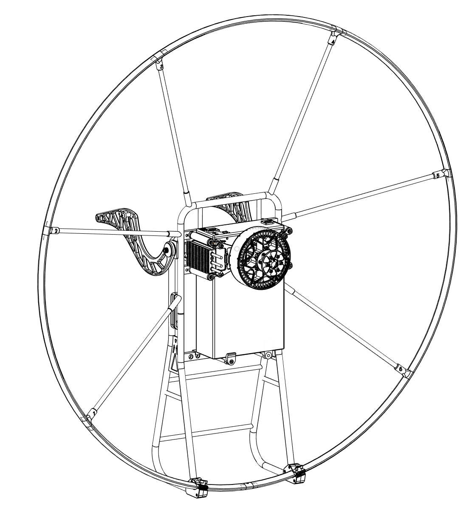

# Welcome to Your SP140 v2.5 Manual

**Version 1.01 | January 2026**

This comprehensive guide covers everything you need to safely assemble, operate, and maintain your OpenPPG SP140 v2.5 Electric Paramotor. Whether you're unboxing for the first time or need a quick reference, you'll find detailed instructions and important safety information here.


**Read this entire manual before operating your SP140 v2.5.** Understanding your equipment is essential for safe operation. This is not a toy - proper training from a certified paramotor instructor is required.


---

## 🎥 Quick Start Videos

The fastest way to get started! Watch our comprehensive video tutorials that walk you through assembly and operation.







**Or scan these QR codes with your phone:**

<table>
<tr>
<td align="center" width="50%">
<strong>Frame Assembly</strong> 

</td>
<td align="center" width="50%">
<strong>Power Pack Assembly</strong> 

</td>
</tr>
</table>

---

## 📖 Manual Sections

### 🚀 Getting Started








---

### 🔧 Assembly & Setup


Follow our step-by-step assembly guide to build your SP140 safely and correctly.






#### Assembly Steps

1. **[Unboxing](assembly/01-unboxing/)** - Verify all parts are included and inspect for damage
2. **[Center Frame](assembly/02-center-frame/)** - Build the main structural frame
3. **[CF Spars & Hoop Connectors](assembly/03-spars-hoops/)** - Install carbon fiber components
4. **[Netting & Gooseneck Bar](assembly/04-netting-gooseneck/)** - Add safety netting and gooseneck
5. **[Power Pack & Harness](assembly/05-power-pack-harness/)** - Mount battery and electronics
6. **[Hand Controller & Battery](assembly/06-controller-battery/)** - Complete final connections and test

---

### ✈️ Operation








---

### 🛠️ Maintenance & Care






---

### 💬 Support & Resources







---


Contact us at **[info@openppg.com](mailto:info@openppg.com)** or visit our [support page](support/) for assistance.

