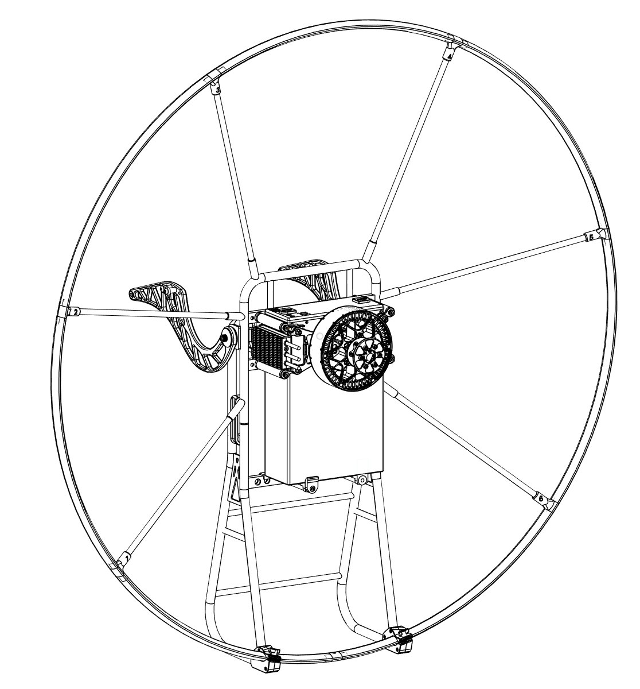

  

    
Version 1.02 • January 2026

    
Complete assembly and operation guide for your OpenPPG SP140 v2.5 electric paramotor. Watch the video tutorials below to get started safely.

  

  

    
  

---

  <h2>Quick Start Video Tutorials</h2>
  
Watch these essential videos to learn how to safely assemble and operate your SP140.

  

    <h3>Frame Assembly</h3>
    

      
    

  

  

    <h3>Power Pack Assembly</h3>
    

      
    

  

---

  <h2>Manual Sections</h2>
  
Explore the complete SP140 v2.5 documentation below.



---

  Now in Beta
  <h2>OpenPPG Mobile App</h2>
  
Connect to your SP140 v2.5 over Bluetooth for live telemetry, a moving map, a cockpit display you build yourself, and automatic flight logging. Available now in beta for iOS and Android.

  <a class="app-cta" href="https://openppg.com/beta/">Join the beta</a>

